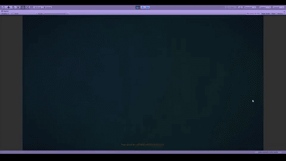
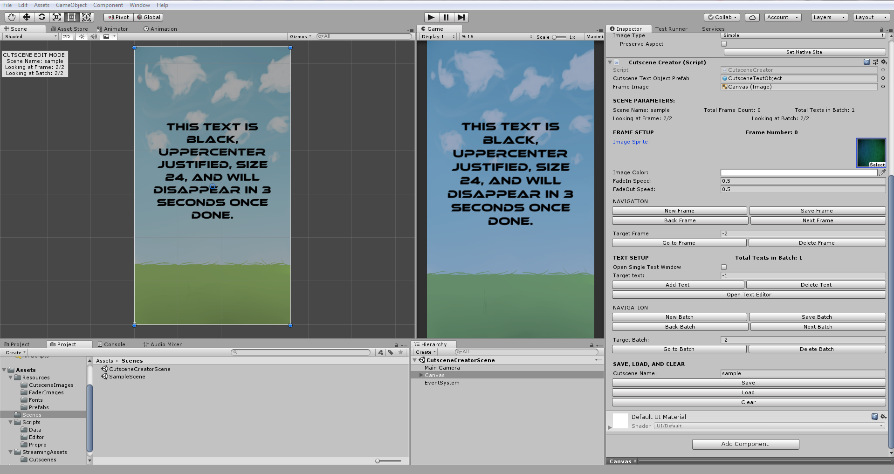
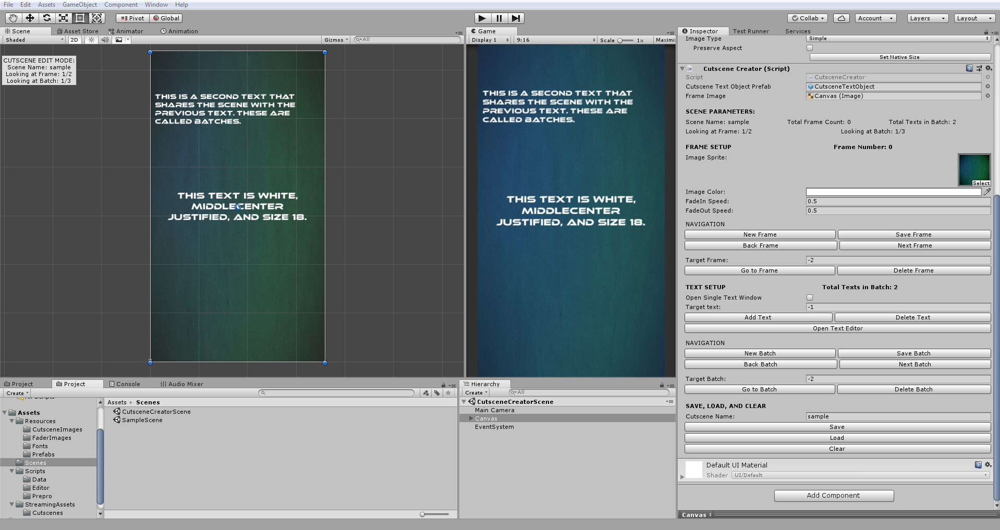
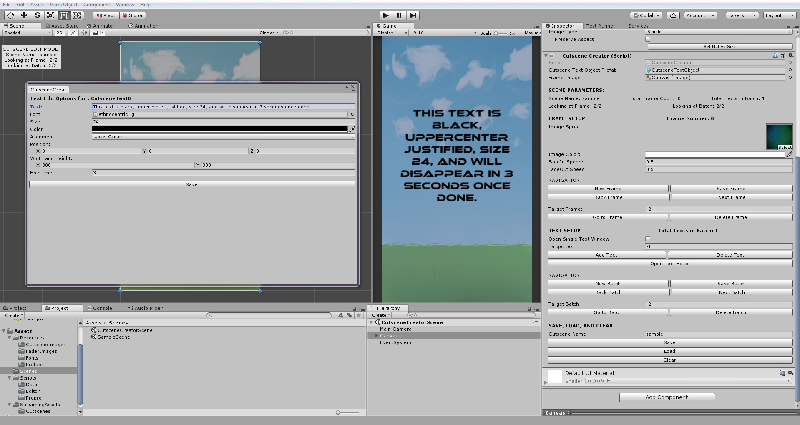

# Description
This is a very simple 2D cutscene manager for Unity. It is meant to be used to for cutscenes that
that only require background images, text, and simple fades, and are to be set up in using the Unity UI.

In addition, there is an editor to create and edit cutscenes from within the Unity Editor. All cutscenes are
saved as .json files in a Cutscenes folder that is within a special Unity folder known as [StreamingAssets] 
( https://docs.unity3d.com/Manual/StreamingAssets.html ).

# Features
- A cutscene manager class that can run your cutscenes.
- A custom inspector window for creating and editing cutscenes within the Unity Editor
- A sample cutscene to test it out

# How to Use

Cutscenes have been divided into sections called "frames". A frame changes whenever the background image would
change or transition to a new image. A frame can have anywhere from no text to hundreds of texts. You can edit the
background image, its color, and the speed at which to fade in and fade out of a frame. These are set in the area
labelled "FRAME SETUP" in the inspector.

Texts occur in "batches". A batch of text will retain all texts within it on the screen until the entire batch
is finished. When a batch of text concludes, it will remove all text from the screen and begin the next batch.
If you ever want to display only one text at a time on the screen, simply create a batch with only one text.

To edit individual texts, a separate window is called by using the "Open Text Editor" button. This will open
a window for each text within the current batch. You can edit the text, font, font size, font color, text alignment,
position, and width and height of a text. There is another parameter called "hold time" which represents how long in 
seconds to wait before the next cutscene action will occur such as the next text or the start of a new frame.
There are a few nuances detailed below.
- These windows will open on top of each other with the highest numbered text in the order (or the last text) being on top. 
- Clicking outside of the inspector or text editor windows such as in the scene or the hierarchy will remove focus from cutscene creator and may result in all unsaved progress being lost.
- "Open Text Editor" can be used with the "Target text" field to open a single window for a specific text. It will open a text based on the index set. This is enabled by checking of the "Open Single Text Window" option.

Both frame setup and text setup have an area called NAVIGATION. This is used to step through the frames and batches you've
created.
- New: Create a new frame or batch
- Save: Save the frame or batch you're editing
- Next: Go to the next frame or batch is possible
- Back: Go to the previous frame or batch if possible
- Go to: Go to frame or batch with an index set in "Target Batch". NOTE: A value of -1 for frames and batches will target the current one.
- Delete: Delete frame or batch with an index set in "Target Batch". NOTE: A value of -1 for frames and batches will target the current one.
- Add Text: Add a gameObject as a child to the canvas that contains the texts to edit in a batch.
- Delete Text: Delete text with index set in "Target text".

In addition, there are the save, load, and clear buttons. Both save and load require a "Cutscene Name" to be filled. It will
save the cutscene to a file given that name or attempt to load a cutscene file given that name. Clear will reset the entire
creator, wiping clean all of the currently active frames, texts, and batches.

# Licensing
This is open source so it is free to use and free to edit without having to give any credit.